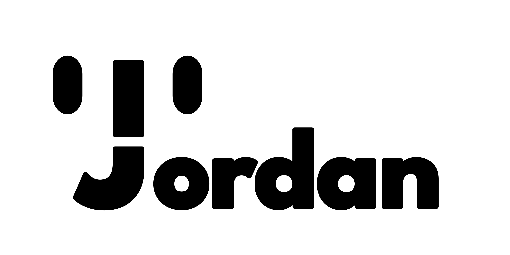

<a href="https://jordanbrotherton.github.io/" align="center">
    <picture>
        <!-- Dark Logo -->
        <source media="(prefers-color-scheme: dark)" srcset="logo_dark.svg">
        <!-- Light Logo -->
        <source media="(prefers-color-scheme: light)" srcset="logo_light.svg">
        <!-- Fallback Logo -->
        
    </picture>
</a>

    <ul align="center" style="list-style: none;">
        

          <h2>Python, Java, C#</h2>
        

    </ul>

    <picture>
        <!-- Dark Stats -->
        <source
            srcset="https://github-readme-stats.vercel.app/api?username=jordanbrotherton&show_icons=true&theme=dark&bg_color=00000000&hide_border=true&hide_title=true"
            media="(prefers-color-scheme: dark)" align="center"
        />
        <!-- Light Stats -->
        <source
            srcset="https://github-readme-stats.vercel.app/api?username=jordanbrotherton&show_icons=true&bg_color=00000000&hide_border=true&hide_title=true"
            media="(prefers-color-scheme: light), (prefers-color-scheme: no-preference)" align="center"
        />
        <!-- Fallback Stats -->
        
    </picture>

